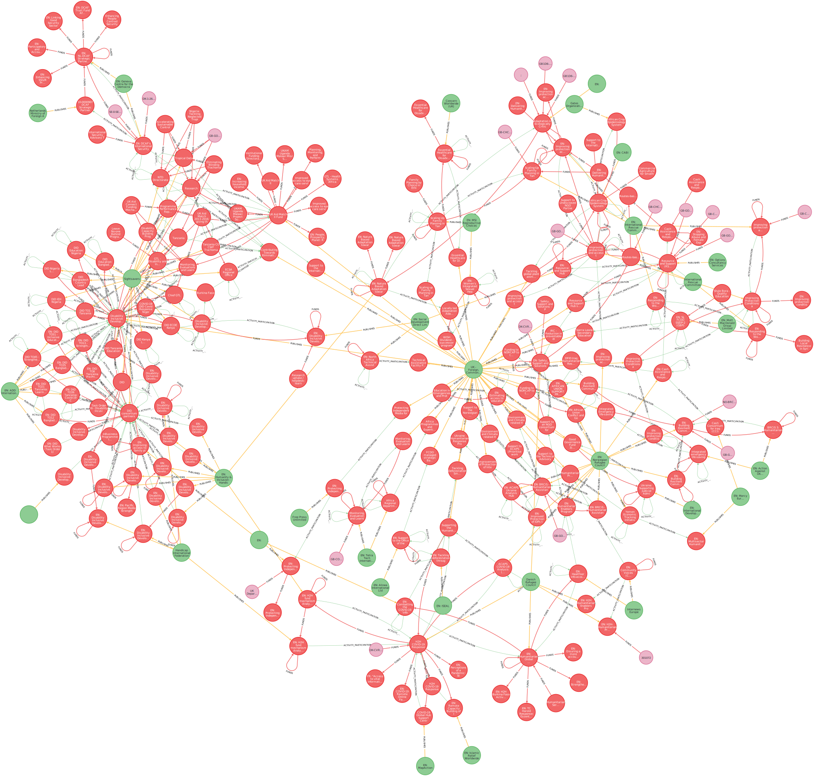

# IATI Graph from Postgres Dump

This project sets up a PostgreSQL and Neo4j database using Docker Compose and processes IATI (International Aid Transparency Initiative) data into a graph database for relational analysis.



## Prerequisites

*   Docker and Docker Compose
*   Make
*   [uv](https://github.com/astral-sh/uv) (for Python package management)

## Setup

1.  **Clone the repository (if applicable):**
    ```bash
    git clone <your-repo-url>
    cd iati-graph-from-pg
    ```

2.  **Install Python dependencies:**
    ```bash
    uv sync
    ```

3.  **Set up Environment:**
    *   Run `make setup-env`. This creates a `.env` file from `.env.example` if it doesn't exist.
    *   Edit `docker-compose.yml` and set secure passwords for `POSTGRES_PASSWORD` and `NEO4J_AUTH`.
    *   *(Optional)* Edit `.env` if you need to change `DBT_PROJECT_DIR` or add other variables.

4.  **Download IATI data dump:**
    ```bash
    make download-dump
    ```
    This will download the `iati.dump.gz` file into the `data/pg_dump/` directory (which is ignored by Git). It uses the `-N` flag to only download if the remote file is newer or the local file is missing.

5.  **Start the databases:**
    ```bash
    make docker-up
    ```
    This will start PostgreSQL (port 5432) and Neo4j (ports 7474, 7687) in the background. The first time Postgres starts, it will attempt to restore the dump from `data/pg_dump/iati.dump.gz` into the `iati` database.

## Usage

*   **Access PostgreSQL:** Connect using a client like `psql` or DBeaver to `localhost:5432` with the password you set.
*   **Access Neo4j Browser:** Open `http://localhost:7474` in your web browser. Log in with username `neo4j` and the password you set.

### Graph Loading Process

The project implements a sequential ETL pipeline that loads data from PostgreSQL into Neo4j. The primary script orchestrates loading in the following order:

1. **Nodes:**
   * Published Activities (aid projects that appear in IATI data)
   * Published Organizations (organizations with IATI publisher accounts)
   * Phantom Activities (activities referenced but not published in IATI)
   * Phantom Organizations (organizations referenced but not formally published)

2. **Relationships:**
   * Participation Links (connects organizations to activities)
   * Financial Transactions (monetary flows between organizations and activities)
   * Funds Links (direct activity-to-activity financial relationships)
   * Hierarchy Links (`:PARENT_OF` relationships between activities)

To build the underlying dbt models and then load the complete graph into Neo4j (running from the project root):
```bash
make dbt-build
make load_graph
```
**Note:** Graph loading scripts (`load_*.py`) and the main `load_graph.py` script are run from within the `graph/` directory by the `make` targets.

You can also run individual loading scripts *from within the `graph/` directory* if needed, after running `make dbt-build`:
```bash
cd graph
uv run python load_published_activities.py
uv run python load_funds_edges.py
uv run python load_hierarchy_edges.py
# etc.
```

To completely wipe the Neo4j database (useful for reloading):
```bash
make wipe-neo4j
```

### SQL Transformations with dbt

The project uses dbt (data build tool) for SQL transformations within the `graph/` directory.

```bash
# Load environment variables from .env into your current shell (run from project root)
source .env 

# Install/update dbt dependencies (run from graph/ directory)
cd graph
uv run dbt deps

# Build dbt models (run from project root)
make dbt-build

# Alternatively, run dbt commands manually from the graph/ directory:
cd graph
uv run dbt run
# Run specific model
uv run dbt run --select model_name
```

### Docker Commands

*   **Stop databases:** `make docker-down`
*   **View logs:** `docker-compose logs -f`
*   **List Makefile targets:** `make help`

### Other Useful Makefile Targets

The `Makefile` provides several convenient targets (run from the project root):

*   `make setup-env`: Creates `.env` from `.env.example` if it doesn't exist.
*   `make download-dump`: Downloads the IATI Postgres dump.
*   `make dbt-build`: Runs `dbt build` within the `graph/` directory.
*   `make load_graph`: Runs the main Python graph loading script (`graph/load_graph.py`).
*   `make wipe-neo4j`: Runs the script to clear all data from the Neo4j database (`graph/wipe_neo4j.py`).
*   `make clone-schemas`: Clones the official IATI-Schemas repository into `additional-resources/IATI-Schemas`. This is not required for the core functionality but can be useful for development or exploration, potentially for agentic development tasks needing schema details.

## Graph Model

The Neo4j graph consists of:

* **Node Types:**
  * `:PublishedActivity` - Activities directly published in IATI data
  * `:PhantomActivity` - Activities referenced but not directly published
  * `:PublishedOrganisation` - Organizations with IATI publisher accounts
  * `:PhantomOrganisation` - Organizations referenced in IATI data

* **Relationship Types:**
  * `:PARTICIPATES_IN` - Connects organizations to activities
  * `:FINANCIAL_TRANSACTION` - Represents financial flows between organizations and activities
  * `:FUNDS` - Direct activity-to-activity funding relationship (aggregated from transactions)
  * `:PARENT_OF` - Represents the hierarchical relationship between activities

## Project Structure

* `docker-compose.yml` - Container configuration
* `postgres-init/` - PostgreSQL initialization scripts
* `data/pg_dump/` - Directory for storing the IATI database dump
* `graph/` - DBT project and Neo4j loading scripts
  * `models/` - DBT models defining SQL transformations
  * `utils/` - Utility scripts (e.g., Neo4j interaction)
  * `load_*.py` - Individual ETL scripts for loading specific nodes/edges
  * `load_graph_sequential.py` - Master script that runs all ETL steps in sequence
  * `wipe_neo4j.py` - Script to wipe the Neo4j database
* `additional-resources/` - Optional directory for supplementary resources (e.g., IATI Schemas cloned via `make clone-schemas`)
* `.env` - Local environment configuration (created via `make setup-env`, ignored by Git)
* `.env.example` - Example environment file
* `Makefile` - Defines common tasks and commands
* `uv.lock`, `pyproject.toml` - Python dependency management files

## Development & Analysis

This project has used Cursor extensively, with a mix of models (generally with 'thinking' mode enforced).

In particular, the use of MCP tools which allow models to interrogate the psql and neo4j databases directly to debug and test, help with design, and refine the use via Cypher queries.

Look at [this json file](./docs/cursor-mcp.json) and copy it's content into `cursor settings/mcp` once you have the local docker services running to use them in Cursor. This file should also be compatible with Claude Code.

Example:

> Use the iati neo4j database to help me understand which organisations work downstream from both the US government and the UK government the most. I'm looking for the ones which have the highest joint exposure to funding originating from both. You'll need to look at the schema first, and then examine organisations first to create a list / pattern to select the right organisations to represent the government institutions, and then you'll need to use your knowledge of graph databasese to develop an approach to find the downstream organisations (and those which are downstream of those via funding or participation. Don't just return me a query - use neo4j to write me a small report outlining your approach and findings.
> 
> Be careful not to use queries which will run indefinitely or max out the server's resources (like uncaped all-graph traversals etc.)

Output (just final report, for full transcript see [this markdown file](./docs/autonomous_analysis_example.md)): 

> Based on our analysis, I'll now compile a report on organizations with the highest joint exposure to funding from both US and UK governments.
> 
> # Organizations with Highest Joint Exposure to US and UK Government Funding
> 
> ## Methodology
> 
> To identify organizations with significant downstream exposure to both US and UK government funding, I analyzed the IATI graph database with the following approach:
> 
> 1. Identified all organizations with the prefix "US-GOV" for US government departments and "GB-GOV" for UK government departments
> 2. Found organizations that participate in activities funded by both US and UK government entities
> 3. Calculated a "joint exposure" metric as the product of US-funded activities and UK-funded activities
> 4. Examined detailed participation patterns for top organizations
> 
> ## Key Findings
> 
> ### Top Organizations by Joint Exposure
> 
> The following organizations demonstrate the highest levels of joint participation in activities funded by both US and UK government entities:
> 
> 1. **World Health Organization (WHO)** - Participates in 2,328 US-funded activities and 1,544 UK-funded activities
> 2. **Sweden** - Participates in 1,646 US-funded activities and 1,897 UK-funded activities
> 3. **German Federal Ministry for Economic Cooperation and Development** - Participates in 1,293 US-funded activities and 1,656 UK-funded activities
> 4. **United Nations Development Programme** - Participates in 1,010 US-funded activities and 1,397 UK-funded activities
> 5. **Global Affairs Canada** - Participates in 1,606 US-funded activities and 647 UK-funded activities
> 
> ### Detailed Analysis: World Health Organization
> 
> The WHO shows the highest joint exposure to both countries' funding:
> 
> - **US Government Participation:**
>   - Primary source: U.S. Agency for International Development (USAID) - 2,328 activities
>   - Secondary source: U.S. Department of State - 27 activities
> 
> - **UK Government Participation:**
>   - Primary source: UK Foreign, Commonwealth and Development Office - 1,520 activities
>   - Secondary source: UK Department of Health and Social Care - 21 activities
>   - Tertiary source: UK Home Office - 9 activities
> 
> This suggests the WHO is a critical implementing partner for both countries' international development and health security objectives.
> 
> ## Observations
> 
> 1. **Multilateral Organizations Dominate**: UN agencies (WHO, UNDP, WFP, UNAIDS) feature prominently in joint funding, suggesting they serve as preferred vehicles for both countries' international development agendas.
> 
> 2. **Peer Government Agencies**: National development agencies from other countries (Sweden, Germany, Canada, Australia) also feature in the top list, indicating significant triangular cooperation between the US, UK, and other donor countries.
> 
> 3. **Humanitarian Focus**: Organizations with humanitarian mandates (UN OCHA, WFP, IOM) feature prominently, suggesting this as a key area of joint US-UK funding priority.
> 
> 4. **Limited Private Sector Representation**: Only one private foundation (Gates Foundation) appears in the top 15, suggesting that bilateral/multilateral channels remain the dominant vehicles for US-UK joint funding.
> 
> ## Conclusion
> 
> This analysis reveals that the international aid ecosystem has several key organizations that are heavily exposed to both US and UK government funding. The prevalence of multilateral organizations at the top of the list suggests these entities serve as important channels for coordinating bilateral priorities from both donor countries.
> 
> These findings could help stakeholders understand which organizations would be most affected by policy shifts in either the US or UK development funding landscapes, and identify the most influential implementing partners for both countries' international development objectives.