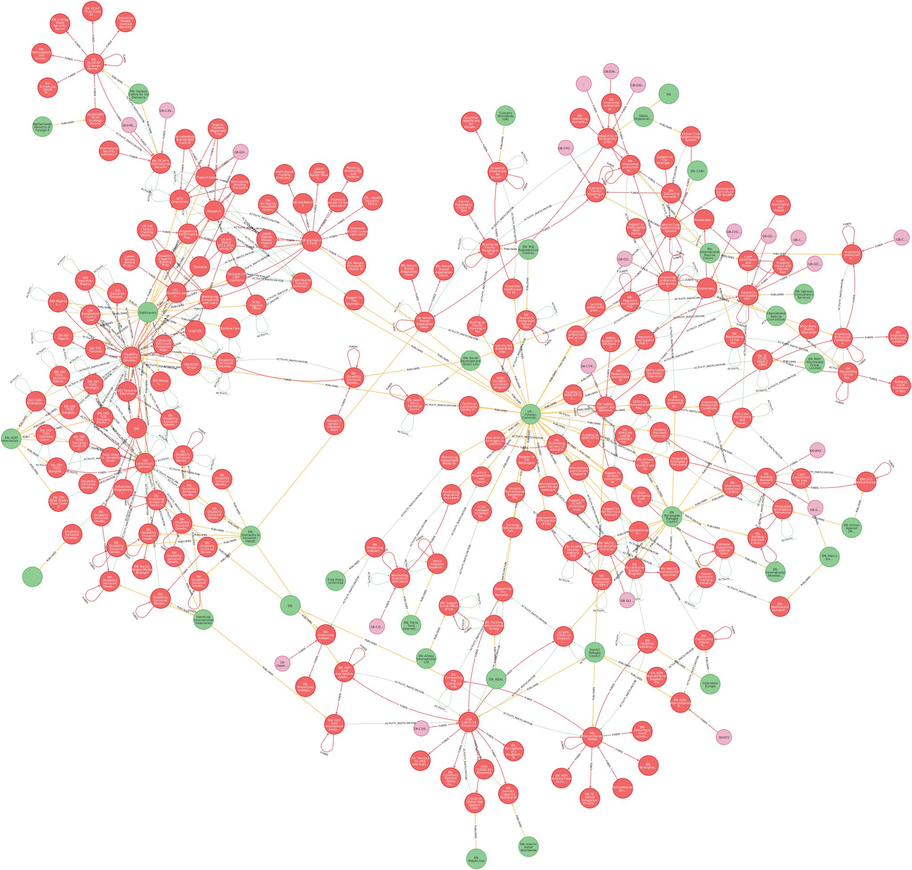

# Tracing the Flow of Aid: Building an IATI Graph Database

The world of international aid is a complex web of donors, intermediaries, and implementing organisations, all working towards global development and humanitarian goals. Understanding the intricate pathways of funding – from its origin to its ultimate impact – is crucial for transparency, accountability, and effective decision-making. This is the challenge of 'traceability', a concept I first explored during my time at the UK's Foreign, Commonwealth & Development Office (FCDO).

Recently, I decided to revisit this challenge by developing `iati-graph-from-pg`, a tool that transforms data from the International Aid Transparency Initiative (IATI) into a Neo4j graph database. This post delves into the 'why' and 'how' of this project, highlighting the development journey and the powerful capabilities of graph databases for analysing aid flows.


*A visualisation of a segment of the IATI graph, showcasing FCDO's participation network.*

## The Quest for Aid Traceability with IATI Data

The [International Aid Transparency Initiative (IATI)](https://iatistandard.org/) provides a global standard for publishing information about aid activities. While incredibly valuable, the sheer volume and relational nature of IATI data, often presented in XML or tabular formats, can make it challenging to follow the complete journey of funds or understand complex partnership networks. True traceability means being able to answer questions like:

*   Which organisations are funded by a specific donor for a particular sector?
*   How many intermediaries are involved before funds reach a project on the ground?
*   Which recipient countries benefit most from collaborations between certain donors?

Graph databases, with their focus on nodes and relationships, offer a natural and intuitive way to model and query such interconnected data.

## Architecting the Solution: From Postgres to Neo4j

The `iati-graph-from-pg` tool employs a multi-stage process to ingest, transform, and load IATI data into a queryable graph. Here's a look at the architecture:

```mermaid
flowchart LR
    subgraph UserInteraction["User / Developer"]
        direction LR
        user([User]) -.-> make[Makefile Commands]
    end

    // Central definition of database components
    subgraph Databases["Databases (Docker Services)"]
        direction TB 
        postgres_container[PostgreSQL Container]
        neo4j_container[Neo4j Container]
        iati_db_node[("iati DB (Raw Data + Graph Preprocessing)")] 

        postgres_container -. "hosts" .-> iati_db_node 
    end
    
    subgraph DataIngestion["Data Ingestion & Preparation"]
        direction TB
        iati_dump[("iati.dump.gz (External Data Source)")] 
        pg_dump_dir["data/pg_dump/"] 
        dbt_process["dbt build (in graph/)"] 

        make -- "make download-dump" --> iati_dump
        iati_dump --> pg_dump_dir
        
        make -- "make docker-up (starts services)" --> Databases 

        pg_dump_dir -.->|Mounted Volume| postgres_container
        postgres_container -- "init-db.sh populates" --> iati_db_node 
        
        make -- "make dbt-build" --> dbt_process
        dbt_process -- "SQL Transforms data in" --> iati_db_node
    end

    subgraph GraphLoading["Graph Loading"]
        direction TB
        python_scripts["Python Scripts (graph/load_graph_sequential.py)"] 
        make -- "make load-graph" --> python_scripts
        python_scripts -- "Reads from" --> iati_db_node
        python_scripts -- "Writes to" --> neo4j_container
    end
    
    subgraph UserAccess["User Access"]
        direction LR
        user_psql([User via psql/client]) -.-> postgres_container
        user_neo4j_browser([User via Neo4j Browser]) -.-> neo4j_container
    end

    user --> make

    style iati_dump fill:#f9f,stroke:#333,stroke-width:2px
    style pg_dump_dir fill:#lightgrey,stroke:#333,stroke-width:1px
    style iati_db_node fill:#lightblue,stroke:#333,stroke-width:2px
    style postgres_container fill:#add8e6,stroke:#333,stroke-width:2px
    style neo4j_container fill:#add8e6,stroke:#333,stroke-width:2px
    style dbt_process fill:#ffcc99,stroke:#333,stroke-width:2px
    style python_scripts fill:#ccffcc,stroke:#333,stroke-width:2px
```

**1. Data Ingestion & Initial Staging:**
The process begins by downloading the official IATI PostgreSQL dump. This dump is restored into a PostgreSQL database running in Docker. This gives us a structured relational starting point.

**2. Transformation with dbt:**
Before the data is graph-ready, it needs cleaning, shaping, and pre-processing. This is where `dbt` (data build tool) comes in. Dbt models, defined as SQL `SELECT` statements, transform the raw IATI tables into clearer, analysis-ready tables within PostgreSQL. These tables often serve as staging areas for specific nodes and relationships in our target graph. For example, dbt models are used to:
*   Deduplicate organisation and activity identifiers.
*   Create intermediate tables that link financial transactions to participating organisations.
*   Aggregate data for clearer relationship properties.

**3. Loading into Neo4j:**
With the data prepared in PostgreSQL, Python scripts manage the Extract, Transform, Load (ETL) process into Neo4j. The `graph/load_graph_sequential.py` script orchestrates a series of individual loaders (e.g., `load_published_activities.py`, `load_participating_org_edges.py`) that:
*   Create `:PublishedActivity` and `:PublishedOrganisation` nodes (and their "phantom" counterparts for referenced entities not fully described in the dataset).
*   Establish relationships like `:PARTICIPATES_IN`, `:FINANCIAL_TRANSACTION`, `:FUNDS` (an aggregated view of financial flows), and `:PARENT_OF` (for activity hierarchies).

## Supercharging Development with Cursor's MCP

A significant productivity booster throughout this project was the use of Cursor's integrated database querying capabilities, presumably through what might be termed Model-Controllable Programming (MCP) servers. This allowed for direct interaction with both the PostgreSQL staging database and the Neo4j graph database from within the development environment.

**Iterating on dbt Models:**
When building the dbt transformations, it was crucial to inspect the source data and the output of intermediate models. For instance, while developing a dbt model to identify unique participating organisations, I could quickly run SQL queries against the PostgreSQL database directly in Cursor:

```sql
-- Example: Checking distinct reporting organisation identifiers in the raw activity table
SELECT DISTINCT reporting_org_ref, COUNT(*) AS activity_count
FROM iati_v203_activity_xml_data  -- Hypothetical raw table name
GROUP BY reporting_org_ref
ORDER BY activity_count DESC
LIMIT 20;
```
This immediate feedback loop, without switching to a separate database client, was invaluable for validating logic and ensuring data integrity before it even reached the graph.

**Developing and Testing Cypher Queries:**
Once data started flowing into Neo4j, the MCP integration was equally powerful for developing and testing Cypher queries. For example, to understand the initial funding chain for activities reported by a specific FCDO identifier (e.g., `GB-GOV-1`), I could iteratively build and test queries like this:

```cypher
// Example: Find organisations directly funded by GB-GOV-1 and the activities they implement
MATCH (fcdo:PublishedOrganisation {organisation_identifier: 'GB-GOV-1'})
      -[:PARTICIPATES_IN]->(funded_activity:PublishedActivity)
      -[:FINANCIAL_TRANSACTION]->(recipient_org:PublishedOrganisation)
WHERE recipient_org <> fcdo // Ensure recipient is not FCDO itself
OPTIONAL MATCH (recipient_org)-[:PARTICIPATES_IN]->(downstream_activity:PublishedActivity)
RETURN 
    fcdo.name AS FCDO_Name, 
    funded_activity.title AS FundedActivity, 
    recipient_org.name AS RecipientOrgName,
    COLLECT(DISTINCT downstream_activity.title)[..5] AS SampleDownstreamActivities
LIMIT 10;
```
Being able to write, execute, and refine these queries directly within Cursor, seeing the results, and then perhaps jumping back to the Python loading scripts or dbt models based on those results, streamlined the entire development and debugging process. This tight feedback loop is essential when dealing with complex graph structures and ETL pipelines.

## What's Next?

With the IATI data now modelled as a graph, a wealth of analytical possibilities opens up:
*   **Complex Pathfinding:** Tracing funds across multiple organisations and activities.
*   **Network Analysis:** Identifying key influencers, central actors, or clusters of collaboration.
*   **Impact Assessment:** Potentially linking funding to results data (if available and connectable).

This project provides a solid foundation. Future enhancements could involve incorporating more IATI data elements, adding temporal analysis capabilities, or developing more sophisticated analytical queries and visualisations.

## Conclusion

Transforming IATI's rich dataset into a graph database unlocks new dimensions for understanding international aid. The journey of building `iati-graph-from-pg` underscored not only the suitability of graph technology for this domain but also the significant benefits of modern development environments like Cursor that seamlessly integrate with various data sources. By making complex relational data more accessible and queryable, we can move closer to the goal of full aid traceability and, ultimately, more effective and transparent global development. 